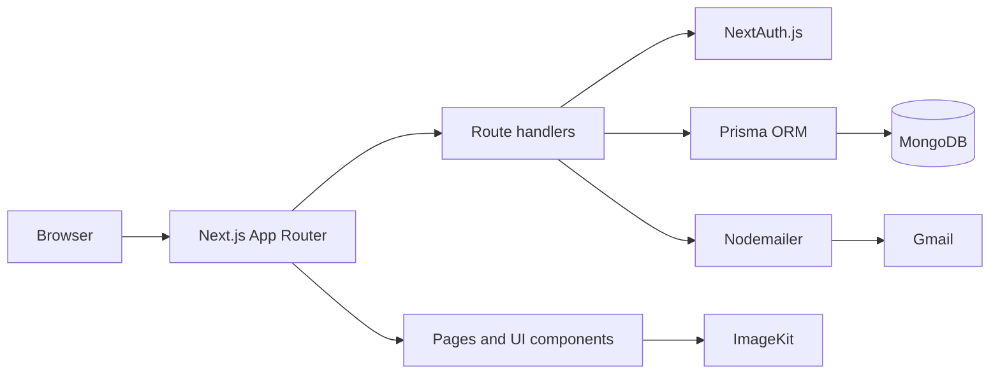

# TechKshetra

The official web platform for **TechKshetra**, the Computer Science and Information Technology club of B. K. Birla College of Arts, Science and Commerce.

[View the live website](https://techkshetra.vercel.app/) | [View the source code](https://github.com/Gamoventure1175/Techkshetra)

## Overview

TechKshetra gives students and visitors a central place to learn about the club, discover events, browse highlights, meet the team, and access curated courses. The application combines a responsive public website with account registration, email verification, protected course access, profile management, and password recovery.

## Features

- Responsive event calendar with event details and registration links
- Mobile-friendly date selection for smaller screens
- Course catalogue available to authenticated users
- Credentials-based registration and sign-in with student and visitor account types
- Email verification using time-limited verification tokens
- Forgot-password, reset-password, and authenticated password-change flows
- User profile displaying account and student information
- Club highlights with animated slideshows and image galleries
- Team-member and mentor profiles
- Responsive navigation, preloaders, page transitions, and smooth-scrolling effects
- Optimized remote images through Next.js Image and ImageKit

## Technology Stack

| Area | Technologies |
| --- | --- |
| Application | Next.js 14, React 18, JavaScript |
| UI | Material UI, Tailwind CSS, Emotion |
| Animation | Framer Motion, Lenis, Three.js, React Three Fiber |
| Authentication | NextAuth.js, credentials provider, JSON Web Tokens, bcrypt.js |
| Data access | Prisma ORM |
| Database | MongoDB |
| Email | Nodemailer with Gmail |
| Events | FullCalendar |
| Images | Next.js Image, ImageKit |
| Deployment | Vercel |

## Architecture



Public club content such as events, courses, highlights, mentors, and team members is maintained in JavaScript data files. Account, session, and verification data is persisted in MongoDB through Prisma.

## Project Structure

```text
.
├── app/
│   ├── api/auth/          # Authentication and account route handlers
│   ├── auth/              # Sign-in, sign-up, verification, and recovery pages
│   ├── aboutus/           # Club, team, and mentor information
│   ├── courses/           # Authenticated course catalogue
│   ├── events/            # Event calendar
│   ├── highlights/        # Event galleries and highlights
│   └── profile/           # User profile and password management
├── components/            # Shared UI and interactive components
├── context/               # Application-wide UI context
├── data/                  # Events, courses, highlights, mentors, and members
├── libs/                  # Authentication, email, Prisma, and image utilities
├── prisma/                # MongoDB data model
├── public/                # Static assets
├── style/                 # Component and layout styles
└── theme/                 # Material UI theme configuration
```

## Getting Started

### Prerequisites

- Node.js and npm
- A MongoDB database
- A Gmail account configured for application email

### 1. Clone the repository

```bash
git clone https://github.com/Gamoventure1175/Techkshetra.git
cd Techkshetra
```

### 2. Install dependencies

```bash
npm install
```

### 3. Configure environment variables

Create a `.env.local` file in the project root:

```dotenv
DATABASE_URL="mongodb+srv://<username>:<password>@<cluster>/<database>"
NEXTAUTH_URL="http://localhost:3000"
NEXTAUTH_SECRET="<random-secret>"
EMAIL_SERVER_USER="<gmail-address>"
EMAIL_SERVER_PASSWORD="<gmail-app-password>"
```

Generate a suitable NextAuth secret with:

```bash
openssl rand -base64 32
```

Use a Gmail app password rather than your normal account password. Never commit environment files or credentials to source control.

### 4. Generate the Prisma client

Prisma CLI may not automatically load `.env.local`. On Bash or Zsh, export its values before running Prisma commands:

```bash
set -a
source .env.local
set +a
npx prisma generate
```

When connecting a new database, synchronize the Prisma schema:

```bash
npx prisma db push
```

### 5. Start the development server

```bash
npm run dev
```

Open [http://localhost:3000](http://localhost:3000) in your browser.

## Available Scripts

| Command | Description |
| --- | --- |
| `npm run dev` | Starts the Next.js development server |
| `npm run build` | Generates the Prisma client and creates a production build |
| `npm run start` | Runs the production server after a build |
| `npm run lint` | Runs the Next.js linter |

## Main Routes

| Route | Purpose |
| --- | --- |
| `/` | Landing page |
| `/aboutus` | Club, team-member, and mentor information |
| `/events` | Responsive event calendar |
| `/courses` | Course catalogue for signed-in users |
| `/highlights` | Club highlight galleries |
| `/auth/signup` | Account registration |
| `/auth/signin` | Credentials-based sign-in |
| `/auth/forgot-password` | Password-recovery request |
| `/auth/reset-password/[token]` | Token-based password reset |
| `/profile` | Authenticated user profile |
| `/profile/change-password` | Authenticated password change |

## Authentication Flow

1. A student or visitor creates an account with an email address and password.
2. The password is hashed with bcrypt before the user is stored in MongoDB.
3. TechKshetra emails a one-hour verification link to the user.
4. After verification, the user can sign in through NextAuth.js.
5. The application uses a JWT-backed session to protect courses and profile functionality.
6. Password-recovery links expire after one hour and are cleared after a successful reset.

## Updating Club Content

The public content is stored in the `data` directory:

- `data/events.js` controls event dates, descriptions, images, audiences, and registration links.
- `data/courses.js` contains the course catalogue grouped by category.
- `data/highlights.js` defines highlight galleries.
- `data/mentors.js` and `data/teamMembers.js` contain club profiles.

Static assets belong in `public`, while remotely hosted images are loaded through the ImageKit utility in `libs/imagekitloader.js`.

## Deployment

The application is deployed on Vercel. To deploy another instance:

1. Import the GitHub repository into Vercel.
2. Add all required environment variables to the Vercel project.
3. Set `NEXTAUTH_URL` to the production URL.
4. Deploy the project. The build script automatically runs `prisma generate` before `next build`.

## Maintainer

[Gaurav Abhiman Mahajan](https://github.com/Gamoventure1175)
